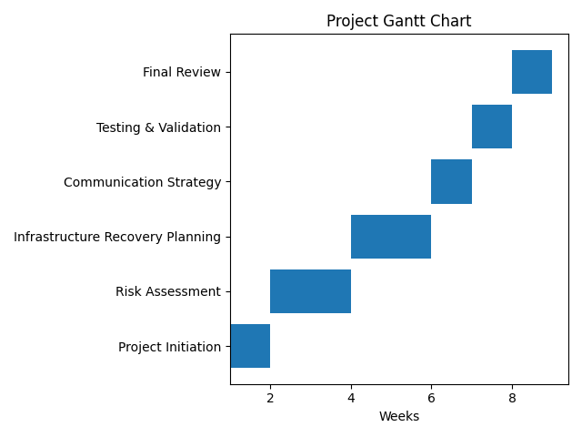
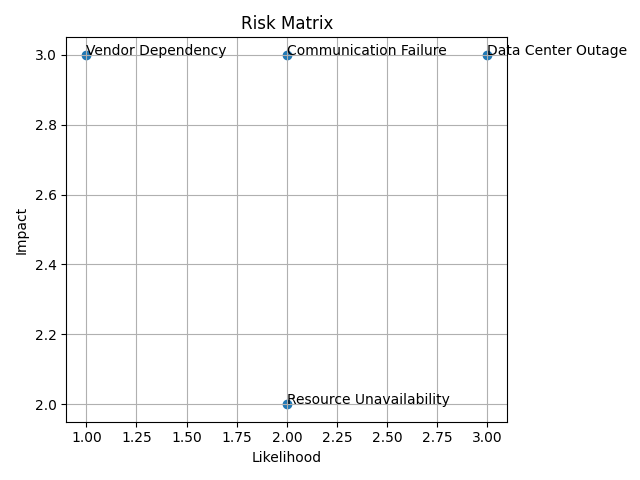
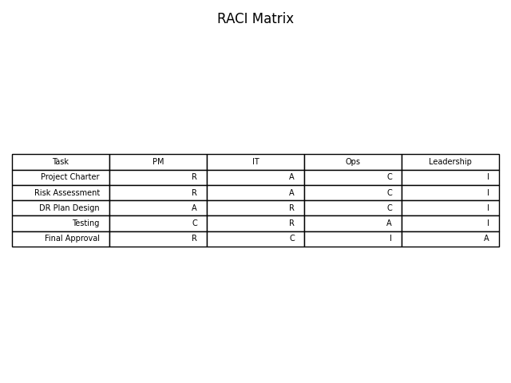

# Disaster Recovery Program – Project Management Case Study

## Overview
This project demonstrates end-to-end project management of a Disaster Recovery & Business Continuity initiative for a mid-size organization. The focus is on planning, risk management, stakeholder coordination, and execution governance.

## Role
**Project Manager (Individual Owner)**  
Owned the project lifecycle including scope definition, scheduling, risk mitigation, stakeholder communication, and final delivery.

## Objectives
- Design a comprehensive disaster recovery plan
- Identify and mitigate operational and IT risks
- Manage dependencies across stakeholders
- Deliver project artifacts aligned with PM best practices

## Key Deliverables
- Project Charter
- Gantt Chart & Schedule
- Risk Matrix
- RACI Matrix
- Stakeholder Communication Plan
- Lessons Learned Report

## Tools & Methodologies
- MS Excel (Gantt, Risk, RACI)
- PMBOK principles
- Risk Management Frameworks
- Stakeholder Mapping

## Visual Artifacts

